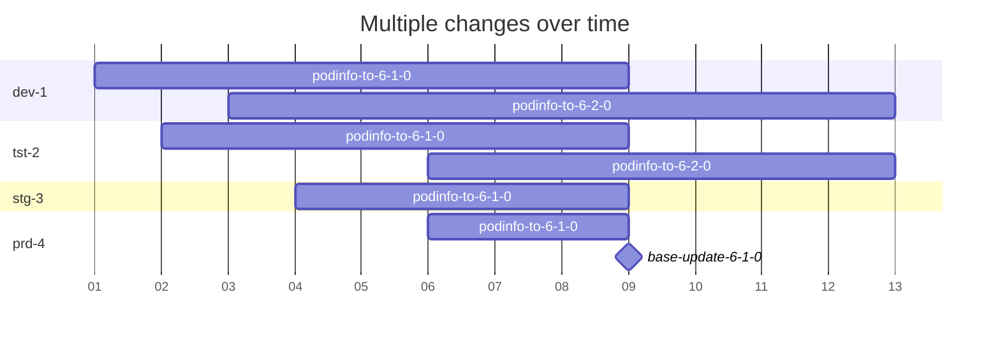

# Rolling out new changes
Changes should be rolled out gradually over the multiple environments. 

Modifications to the `application/` directory affect most environments at the same time. It is discouraged to make changes in the `application/` directory which will result in side effects on the environments.
When creating modifications in the `applications/` directory which have side effects, the pull request will be labeled with the __(risky)__ label.


Changes are used to prevent these risky modifications.
Changes are components which are applied to individual environments.
The changes are then applied to all environments gradually over time.
Once all environments have the desired change, the `application/` directory modification can be safely made without resulting in side effects.



## Guide
1. Create your change using a kustomize component in the `changes/` directory.
    Example:
    ```yaml
    # changes/update-podinfo-to-6-1-0/kustomization.yaml
    apiVersion: kustomize.config.k8s.io/v1alpha1
    kind: Component

    images:
     - name: ghcr.io/stefanprodan/podinfo
       newTag: 6.1.0
    ```
    These changes can involve simple image replacements like above, but could also be much more complex with patches to update any manifests.

    Name the changes in alphabetical order. That way multiple changes can be developed simultaneously. Whe promoting a change, they are sorted alphabetically and the last change will thus be applied last.

2. Add this change to any overlay you want to deploy this change to.
    ```yaml
    # environments/dev-1-aws-us-east1/podinfo/kustomization.yaml
    apiVersion: kustomize.config.k8s.io/v1beta1
    kind: Kustomization

    components:
    - ../../../changes/update-podinfo-to-6-2-1
    - ../../../mixins/envs/dev
    - ../../../mixins/providers/aws
    ```
    Introduce changes gradually by first introducing it to development enviroments. Then, when considers stable, promote the change individually to other environments.
3.  Promote changes to next environments.
    This can be done manually or using the promote workflow in Github.
    Simply copy all change compontents into the next environment.
    ```yaml
    # environments/tst-2-aws-us-east1/podinfo/kustomization.yaml
    apiVersion: kustomize.config.k8s.io/v1beta1
    kind: Kustomization

    components:
      - ../../../changes/update-podinfo-to-6-2-1
      - ../../../mixins/envs/dev
      - ../../../mixins/providers/aws
    ```
4. Once this changes is introduced to all environments it can be applied to the base application.
    ```yaml
    # applications/podinfo/deployment.yaml
    apiVersion: apps/v1
    kind: Deployment
    metadata:
      name: podinfo
    spec:
      template:
        spec:
          containers:
            - name: podinfod
              image: ghcr.io/stefanprodan/podinfo:6.2.1
    ```
    While also being removed from any environment's components.
    ```yaml
    # environments/dev-1-aws-us-east1/podinfo/kustomization.yaml
    apiVersion: kustomize.config.k8s.io/v1beta1
    kind: Kustomization

    components:
    - ../../../mixins/envs/dev
    - ../../../mixins/providers/aws
    ```
    Prefer doing this cleanup in a separate follup pull request. Cleanups/refactors like this should not have any side effects. When properly performed, the pull request should automatically be assigned the __(safe)__ label.
